## 📌 Table of Contents

- What is Kubernetes?
- Docker Container Problems
- How Kubernetes Solves These Problems
- K8s Architecture Overview
- Worker Node / Data Plane
- Kubernetes Cluster Structure
- Pods
- Node
- What Happens if a Node Fails?
- Control Plane (Master)
- API Server
- etcd — Cluster Database
- Scheduler
- Control Manager
- Cloud Controller Manager (CCM)
- Request Flow in Kubernetes
- Kubernetes in Production
- Kubernetes Distributions

---

## What is Kubernetes?

- **Open Source Container Orchestration Platform**
- Containers are **ephemeral** (short-lived) — they die & revive anytime
- Kubernetes *(K8s)* manages, scales & heals containers automatically

---

## Docker Container Problems

### 1. Single Host Problem

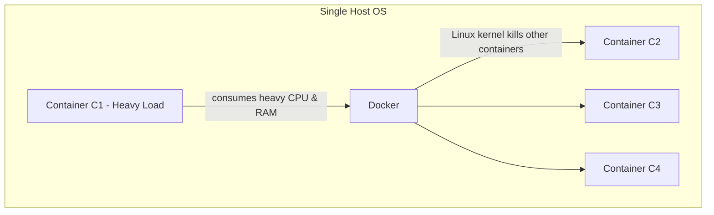

- If **C1** gets heavy traffic, it consumes heavy resources (CPU & RAM)
- Due to C1, the Linux kernel in Host OS will try to **kill C1 or other containers**, or make other containers not run

---

### 2. Auto Healing

- If a container gets killed, it does **not restart automatically** without user intervention
- Manually we need to start it if it gets killed

---

### 3. Auto Scaling

- **Load balancing is not there** in Docker
- Can't handle heavy traffic for a container manually or automatically

---

### 4. Not Enterprise-Level Support

Docker does **not** support the following by default:

| Missing Feature | Description |
|-----------------|-------------|
| Load Balancer | Distribute traffic across containers |
| Firewall | Network security rules |
| Auto Scaling | Scale containers based on load |
| API Gateway | Manage API traffic |
| Auto Healing | Restart failed containers automatically |

---

## How Kubernetes Solves These Problems

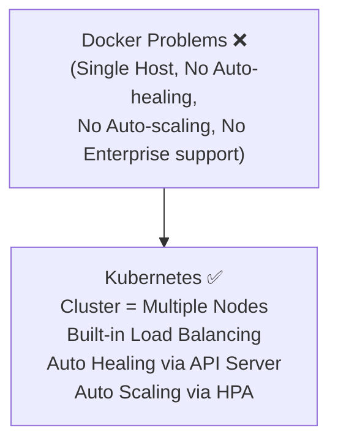

- **i)** It is called a **cluster** because it is not a single machine
- **ii)** Group of multiple machines (nodes) working together as **one system**
- Has **built-in load balancing**

### Single Host Problem → Solved by Cluster

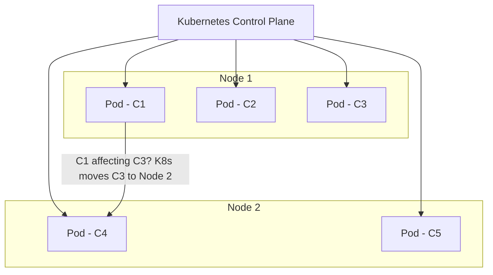

- If C1 is affecting C3, Kubernetes will **move C3 to node 2** (or another node)
- **Auto healing** has been implemented by K8s

---

### Horizontal Pod Autoscaler (HPA)

> Automatically adjusts the number of pods based on the traffic.

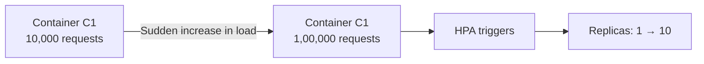


| Scaling Type | How it Works |
|--------------|-------------|
| **Deployment(Static Scaling)** | Manually set how many replicas you want |
| **HPA (Dynamic Scaling)** | Automatically changes replicas based on load |

---

### Auto Healing → Solved by API Server

> Whenever the API Server receives a signal that a container is going **"down"**, it immediately **rolls out a new container (pod)** before the old one completely goes down.

---

## K8s Architecture Overview

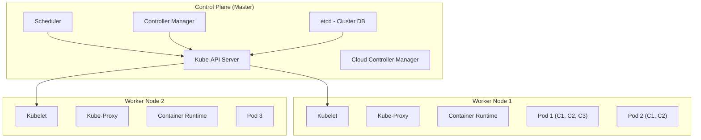

---

## Worker Node / Data Plane

> A **VM or physical server** that runs the actual application containers.

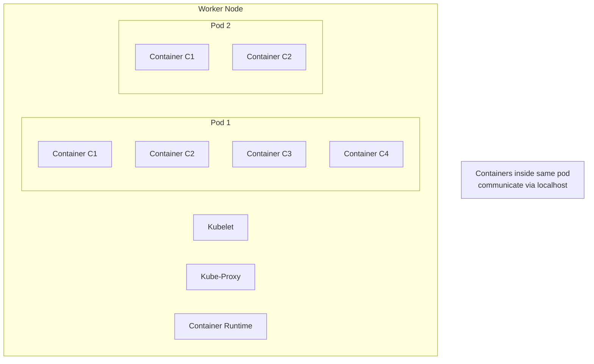

> We can create **N number of nodes** in a cluster.

---

### Kubelet

| | Details |
|-|---------|
| **Runs on** | Every worker node |
| **Communicates with** | Control Plane |

**Responsibilities:**
- i) Start, stop, delete containers
- ii) Monitor health
- iii) Report status back to control plane

---

### Container Runtime

**Runs containers** inside the node.

**Responsibilities:**
- i) Pull image
- ii) Create container
- iii) Start / Stop container
- iv) Manage lifecycle

**Uses (to isolate containers):**
- i) Namespaces
- ii) cgroups
- iii) Linux kernel

```
Kubelet → Container Runtime → Linux Kernel
```

---

### Kube-Proxy

| | Details |
|-|---------|
| **Role** | Handles networking rules |
| **Function** | Distributes traffic |

**Responsibilities:**
- i) Implements Kubernetes Service
- ii) Load balances traffic
- iii) Manages `iptables` / `ipvs` rules

---

## Kubernetes Cluster Structure

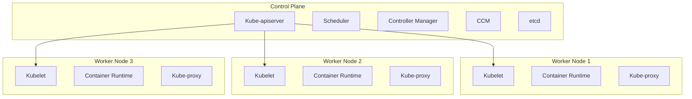

---

## Pods

> Pods are scheduled onto nodes and are the **automatic scaling unit**.

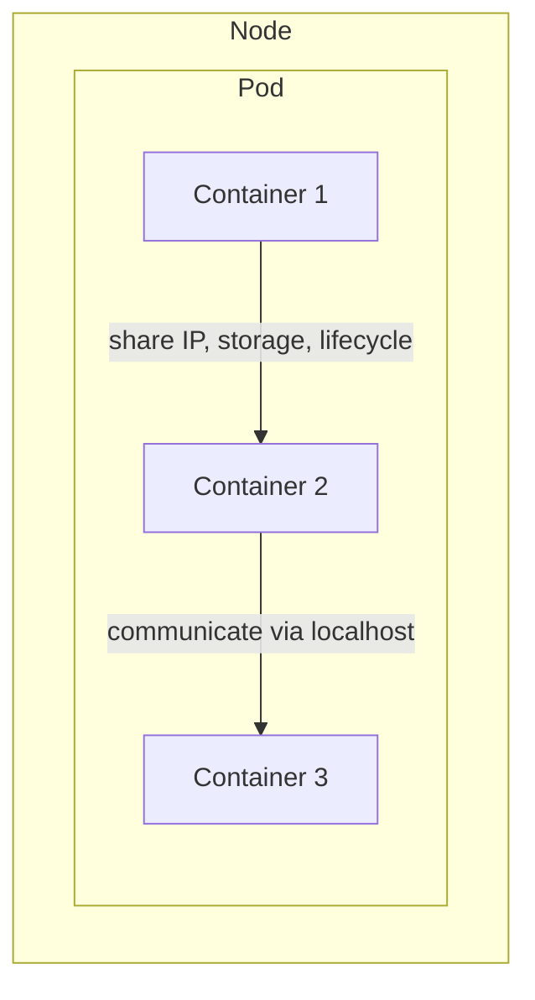

### Each Pod:
| Property | Details |
|----------|---------|
| **IP** | Gets its own unique IP |
| **Containers** | Contains one or more containers |
| **Resources** | Uses node's CPU, RAM, Disk |

### Containers Inside a Pod:
- i) Share **IP**
- ii) Share **storage**
- iii) Share **lifecycle**

---

## Node

> Provides physical/virtual resources to pods.

| Resource | Provided |
|----------|---------|
| CPU | ✅ |
| RAM | ✅ |
| Disk | ✅ |
| Network Bandwidth | ✅ |

---

## What Happens if a Node Fails?

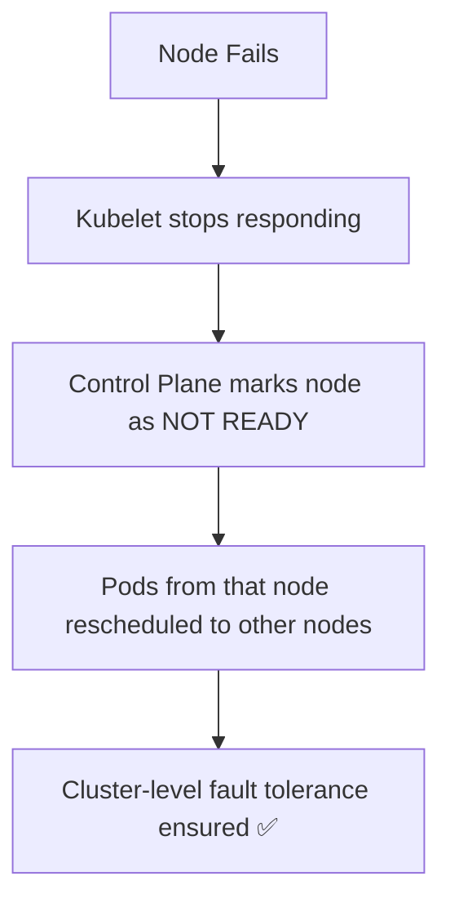

---

## Control Plane (Master)

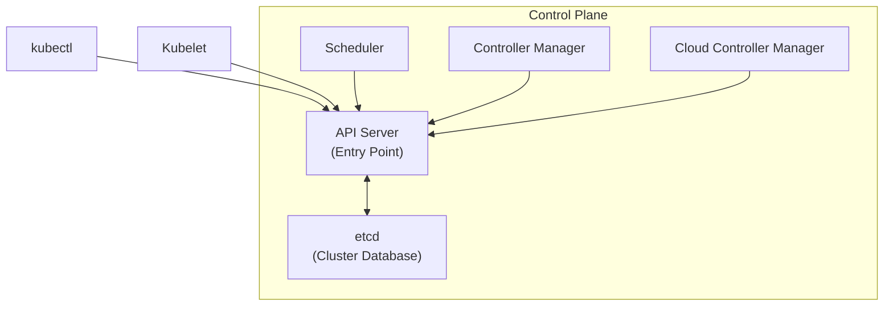

---

## API Server

> Exposes **REST API** — Entry point of the cluster.

- **i)** Entry point of the cluster
- **ii)** Everything talks to the API server:

| Component | Talks to API Server? |
|-----------|---------------------|
| `kubectl` | ✅ |
| `Kubelet` | ✅ |
| `Scheduler` | ✅ |
| `Controller` | ✅ |
| `CCM` | ✅ |

---

## etcd — Cluster Database

> A **distributed key-value database**.

**Stores:**
```
Pods | Deployments | Services | Nodes | ConfigMaps | Secrets | Cluster State
```

> ⚠️ `etcd lost` → `Cluster state is lost`

---

## Scheduler

> **(Kube-Scheduler)** — Decides **which node should run a pod**. It only assigns nodes.

### How Scheduler Works:

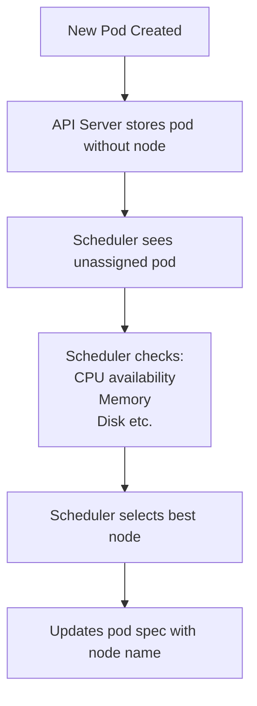

---

## Control Manager

> **Auto Healing Engine**

It runs multiple controllers:

| Controller | Responsibility |
|------------|---------------|
| **ReplicaSet Controller** | Maintains desired replica count |
| **Node Controller** | Monitors node health |
| **Job Controller** | Manages batch jobs |
| **Deployment Controller** | Manages rolling updates |
| **Endpoint Controller** | Manages service endpoints |

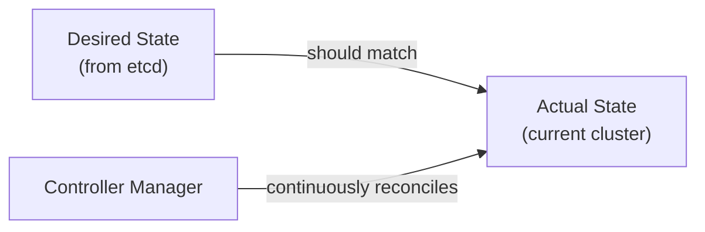

> **Controller** ⇒ Always maintains the **desired state** = **actual state**
> - **Desired state** (via etcd file) — what the system should be
> - **Actual state** — what the system actually is

---

## Cloud Controller Manager (CCM)

- **i)** Used in cloud environments
- **ii)** Connects Kubernetes to cloud provider APIs

**Responsibilities:**

| # | Responsibility |
|---|---------------|
| i | Create Load Balancers |
| ii | Attach Volumes |
| iii | Manage Cloud Routes |

---

## Request Flow in Kubernetes

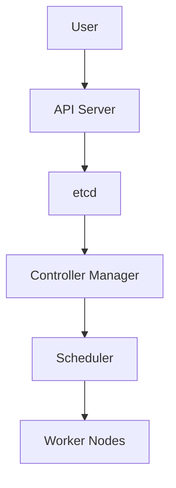

---

## Kubernetes in Production

### Option 1 — Self Managed (Kubeadm)

- Install Kubernetes on your own servers
- Create control plane & worker nodes on your own

### Option 2 — Managed Kubernetes

| Provider | Service |
|----------|---------|
| **Amazon** | EKS (Elastic Kubernetes Service) |
| **Microsoft** | Azure Kubernetes Service (AKS) |
| **Google** | Google Kubernetes Engine (GKE) |

**In AWS EKS:**

```bash
eksctl create cluster       # Create cluster
```

- i) AWS automatically creates control plane
- ii) You only need to add worker nodes

---

### Option 3 — Fully Managed Workers

| Service | Provider |
|---------|---------|
| **EKS Fargate** | Amazon |
| **GKE Autopilot** | Google |

> - You don't need to even manage nodes
> - Just **deploy pods**
> - Cloud automatically **provisions infrastructure**

---

## Kubernetes Distributions

| Distribution | Provider |
|-------------|---------|
| **EKS** | Amazon Web Services |
| **OpenShift** | Red Hat |
| **Tanzu** | VMware |
| **Rancher** | SUSE |

> Kubernetes cluster user experience is provided by these distributions.

- If we use **EKS** (AWS managed Kubernetes service) & ran into a problem, we can ask AWS support & fix it *(Paid)*
- But if we install & configure Kubernetes cluster on **EC2 instance** ourselves, we can only ask about EC2 — not Kubernetes-specific issues
- ➡️ So we use **distributions of Kubernetes**

---

