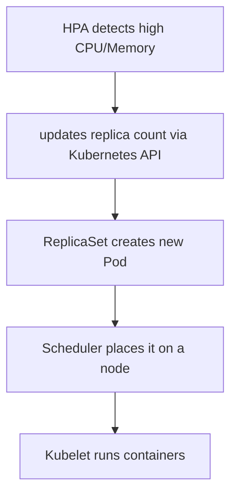
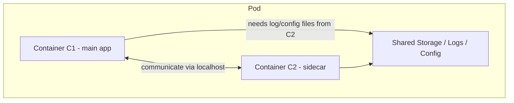
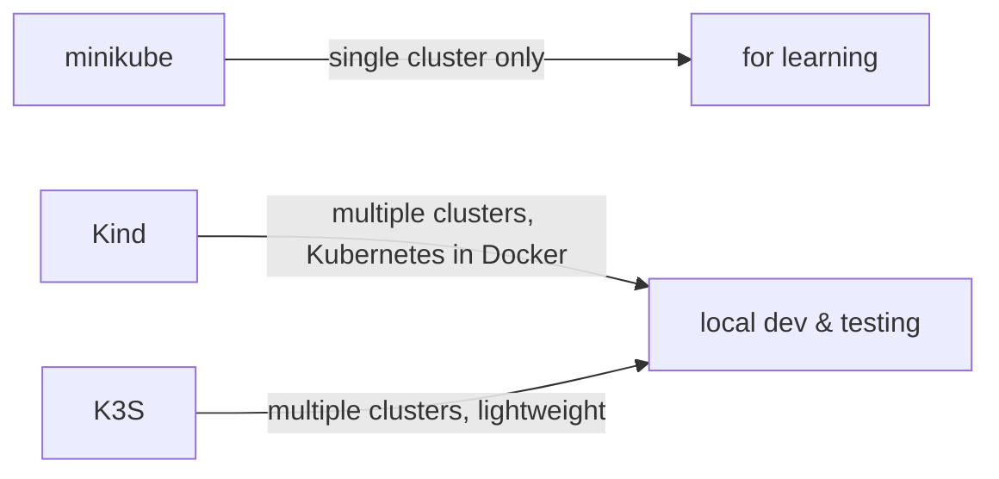
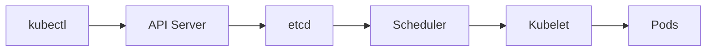
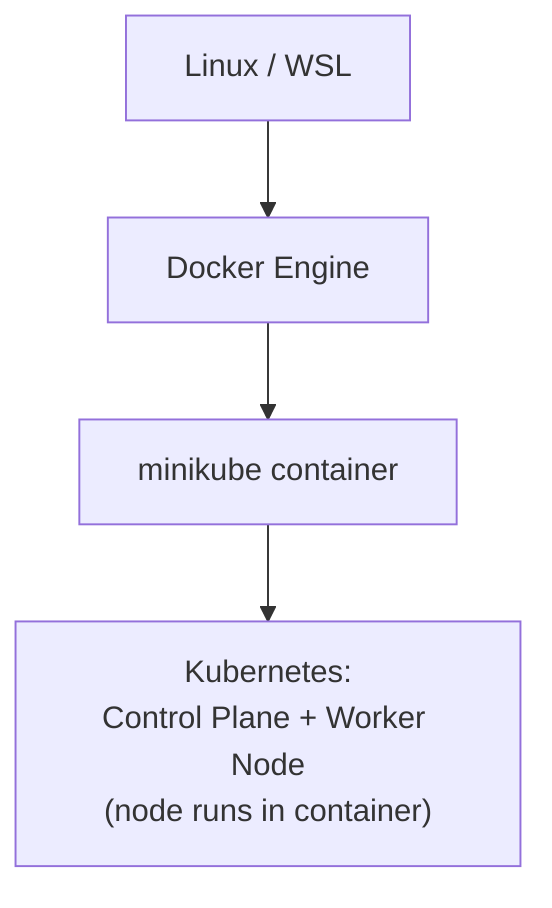
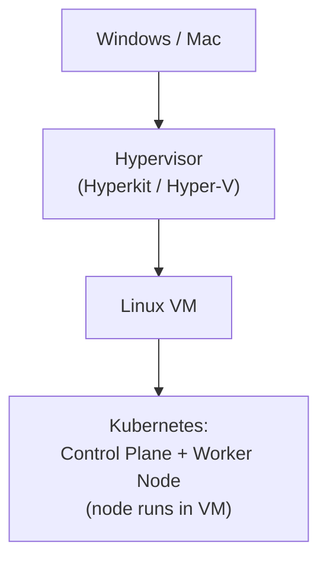
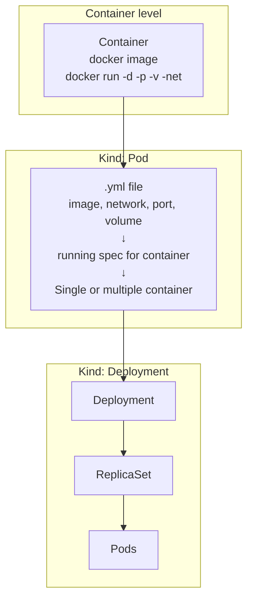
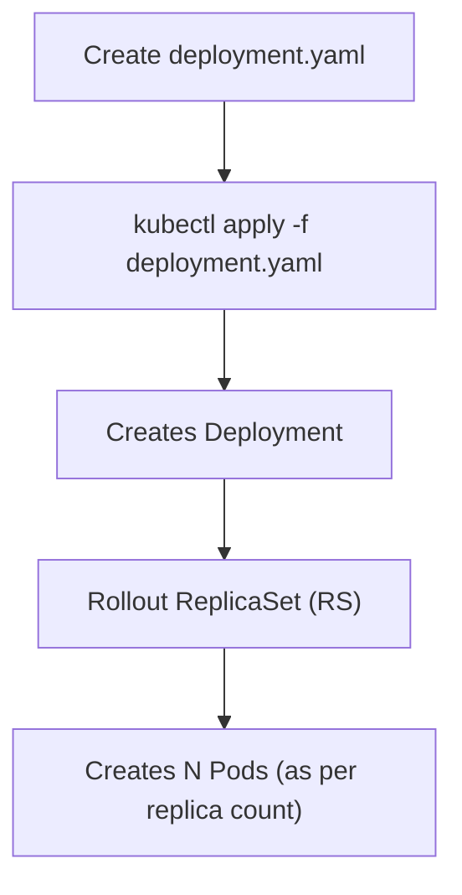
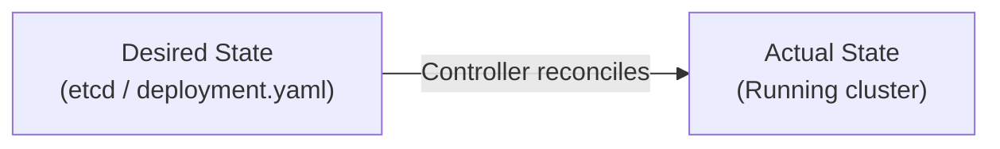

---

## 📌 Table of Contents

- KOPS — Kubernetes Operations
- Replicas & HPA Flow
- Pod — Deep Dive
- kubectl — Control Cluster
- Local Kubernetes Setup
- Minikube
- Pod YAML & Commands
- Troubleshoot Pods
- kubectl Commands Reference
- Kubernetes Deployment
- Deployment Commands
- Controllers


---

## KOPS — Kubernetes Operations

> **KOPS** manages the **lifecycle of Kubernetes clusters**:
> install, upgrade, modify, delete clusters

- Open source **command-line tool** that automates the deployment, management & operational tasks of production-grade Kubernetes clusters.

## Replicas & HPA Flow

**Replicas:**
> Number of **identical pods** Kubernetes should maintain.

**HPA (Horizontal Pod Autoscaler):**
> Automatically changes that number based on **CPU / Memory**



---

## Pod — Deep Dive

### Pod Types

| Type | Pattern | Frequency |
|------|---------|-----------|
| **Single Container** | Standard pod | Mostly used |
| **Multiple Container** | Sidecar pattern | Rare |

### Sidecar Pattern (Multi-Container Pod)



If **C1 needs to access files from C2** (e.g., log/config files), then Kubernetes allows those multiple containers to share:
1. Shared network
2. Shared storage
3. Shared pod IP

They communicate with each other using **localhost**.

### Why Pod? (Wrapper for Container)

Using a YAML file, we can define:
- i) Container
- ii) Volumes
- iii) Tags

> Instead of using CLI commands to run containers, pods make it easy for developers to run containers using a **YAML file**.

---

## kubectl — Control the Cluster

> **Command-line tool** for Kubernetes

```bash
kubectl get nodes         # Get all nodes
kubectl get pods          # Get all pods
kubectl get deployment    # Get all deployments
```

### Local Cluster Tools



| Tool | Clusters | Use Case |
|------|---------|---------|
| **minikube** | Single only | Learning |
| **Kind** | Multiple | Local dev & testing |
| **K3S** | Multiple | Local dev & testing |

### kubectl Request Flow



---

## Local Kubernetes Setup

### Steps

```
i)   Install kubectl
ii)  Install Minikube
iii) Minikube creates a docker container (named "minikube")
```

> Instead of creating a VM, **minikube creates a Docker container**.
> Inside that container:
> - i) A minimal Linux OS
> - ii) Kubernetes components (worker node + control plane) are installed
>
> ➡️ **Kubernetes runs inside a Docker container**

---

## Minikube Internals

### On Linux / WSL



> - No VM needed
> - Lightweight & fast

### On Windows / Mac



---

## Pod YAML & Commands

### Pod YAML Structure

```yaml
apiVersion: v1
kind: Pod
metadata:
  name: nginx
spec:
  containers:
  - name: nginx
    image: nginx:1.14.2
    ports:
    - containerPort: 80
```

### Delete a Pod

```bash
kubectl delete pods <pod_name>
```

---

## kubectl Commands Reference

### Creating Resources

| Command | Behaviour |
|---------|-----------|
| `kubectl create -f filename.yml` | First time creation only — shows **"Already Exists" error** if run again |
| `kubectl create -f .` | Creates all files in current directory |
| `kubectl apply -f filename.yml` | ✅ Safe for production — **creates if not exists, updates if exists** |
| `kubectl apply -f .` | Apply all files in directory |

### Viewing & Accessing Pods

```bash
kubectl get pods                        # List pods
kubectl get pods -o wide                # List pods with IP
kubectl get all                         # List ALL resources (pods, deployments, services, replicasets, jobs, cronjobs, daemonsets)
kubectl get pods -w                     # Watch pods (terminating, pending, running)

# Access pods
minikube ssh                            # SSH into cluster (minikube only)
curl <pod-ip>                           # Curl pod IP

# Production level access
kubectl exec -it <pod-name> -- /bin/sh
```

---

---

## Troubleshoot Pods

| Command | What it Shows |
|---------|--------------|
| `kubectl logs <pod-name>` | Logs of containers in the pod |
| `kubectl describe pod <pod-name>` | List of events of the pod |
| `kubectl get pod <pod-name> -o yaml` | YAML definition of the pod |

---

## Kind: Pod vs Kind: Deployment



| | Kind: Pod | Kind: Deployment |
|-|-----------|-----------------|
| **Use case** | Learning / Testing | Production level |
| **File type** | Simple YAML | Deployment YAML |
| **Features** | Basic container run | Manages pods, supports scaling, healing, updates |


## Kubernetes Deployment

> Provides **Auto Healing**, **Auto healing**, **Rolling updates**, **Rollbacks** and **Replica management**

### Deployment Flow



### Deployment YAML creates:

```
Deployment → ReplicaSet (RS) → Pods
```

```bash
kubectl apply -f deployment.yaml

kubectl get deploy     # view deployments
kubectl get rs         # view replica sets
kubectl get pod        # view pods
kubectl get pods -w    # watch pods live (terminating, pending, running)
```

---

## Controllers

> A **control loop** that continuously watches the cluster and makes sure **actual state = desired state** (via etcd file, API Server)



| Controller | Responsibility |
|------------|---------------|
| **ReplicaSet Controller** | Ensures fixed number of pod replicas are running |
| **Deployment Controller** | Rolling updates, scaling, rollbacks, manages replica sets in `deployment.yaml` |
| **Endpoint Controller** | Manages IPs of the individual pods |

---
