---

## 📌 Table of Contents

- Kubernetes Service — Overview
- Why Kubernetes Service?
- Service Types
- Endpoint
- Port Types Explained
- Container Communication
- Pod to Pod Communication
- Service Types — Deep Dive
- NodePort — How it Works
- Load Balancer — How it Works

---

## Kubernetes Service — Overview

> **A Service routes traffic to pods selected using labels**

The IP address of a pod changes frequently (restarts, kills, etc.), so we access it using a **service name** like `service-name.namespace.svc.cluster.local`.

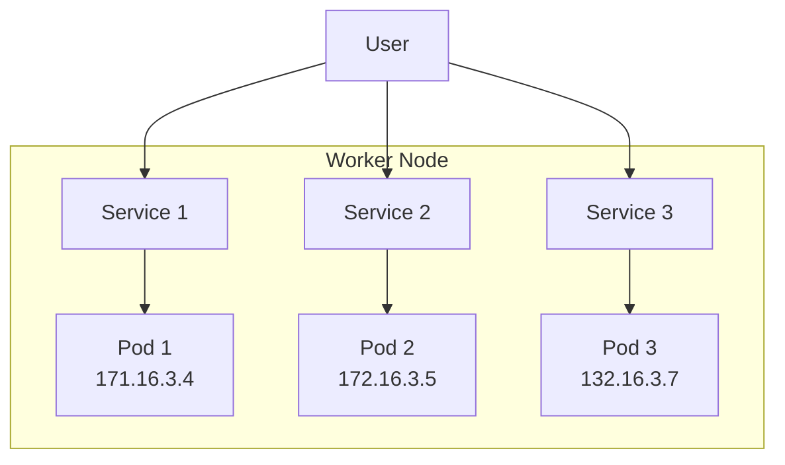

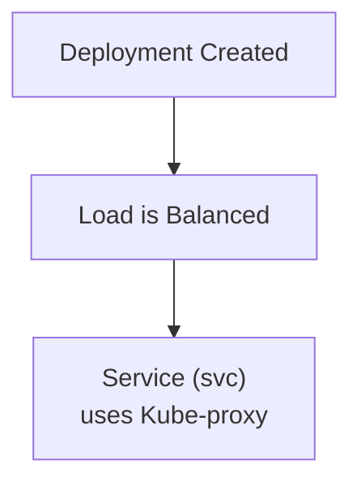

### Labels & Selectors

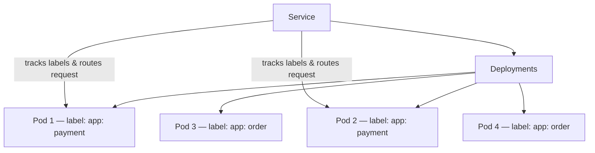

- **Labels & Selectors** are defined for each pod in their `deployment.yml` file
- Service keeps track of those labels & selectors and handles requests by sending to the correct pod

---

## Why Kubernetes Service?

| # | Reason | Description |
|---|--------|-------------|
| i | **Load Balancing** | Distributes traffic across pods |
| ii | **Service Discovery** | Pod discovery via stable service name |
| iii | **Expose to Internet** | Provides a stable IP for external access |

---

## Service Types

| Type | Accessibility | Use Case |
|------|--------------|---------|
| **ClusterIP** | Inside cluster only *(default)* | Internal pod-to-pod communication — SSH into cluster to use |
| **NodePort** | Accessible via Node IP + NodePort *(EC2)* | Dev/staging access |
| **LoadBalancer** | External world via public Elastic IP via CCM | Production |

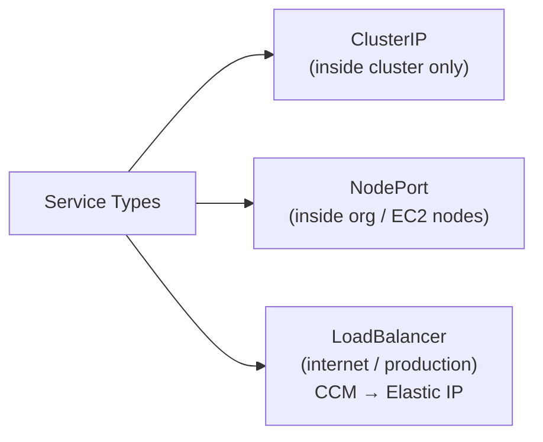

```bash
kubectl get svc     # List all services
```

---

## Endpoint

> Kubernetes uses endpoints to track which pods a service should route traffic to.

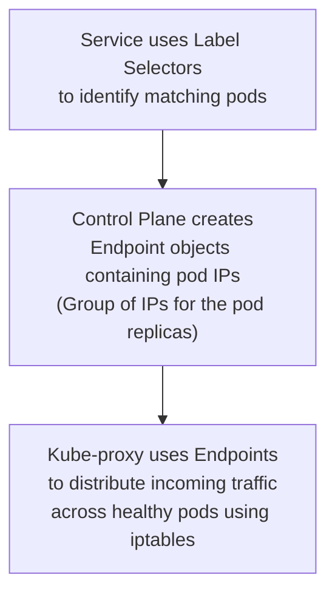

| Step | What Happens |
|------|-------------|
| i | Service uses label selectors to identify matching pods |
| ii | Control plane creates **Endpoint** objects containing pod IPs |
| iii | Kube-proxy uses these endpoints to distribute traffic across healthy pods via `iptables` |

---

## Port Types Explained

> Example config:
> ```yaml
> port: 80
> targetPort: 3000
> nodePort: 3007
> ```

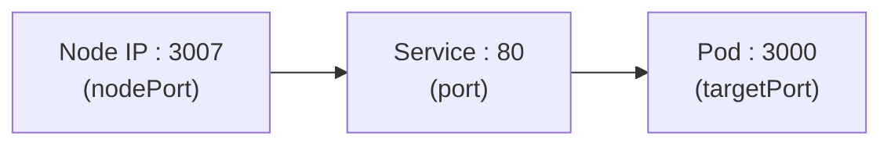

| Port | Mandatory | Description |
|------|-----------|-------------|
| **targetPort** | ❌ Not mandatory *(defaults to `port` value)* | Port **inside the container** where app is running — e.g., `app.listen(3000)` |
| **port** | ✅ Mandatory | Port **exposed by the service** inside the cluster — other pods connect using this port |
| **nodePort** | ✅ Only if `type: NodePort` | Port **opened on each worker node** — range: `30000–32767` |

### Port Flow:
```
[ Node IP : 3007 ] → [ Service : 80 ] → [ Pod : 3000 ]
```

---

## Container Communication

### 1. Container to Container (Same Pod)

> Inside a pod, all containers share:
> - i) Same network namespace (`eth0`)
> - ii) Same IP address (pod IP)
> - iii) Same loopback interface (`localhost`)

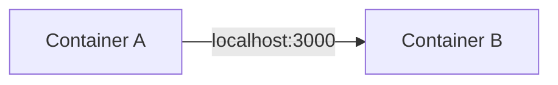

```
Container A → localhost:<port no.> → Container B
```

---

## Pod to Pod Communication

### 2. Pod to Pod (Same Node)

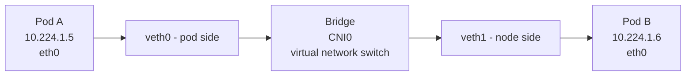

- **veth pair** (virtual ethernet pair):
  - Pod side → `veth0`
  - Node side → `veth1`
- **CNI0** ⇒ Bridge network created by CNI plugin — acts as a **virtual network switch**

```
Pod A → eth0 → veth pair → Bridge (CNI0) → veth pair → eth0 → Pod B
```

**Node 1 example:**
```
10.224.1.5  →  Pod A
10.224.1.6  →  Pod B
```

Direct pod access (for testing only):
```bash
curl http://10.224.1.6:3000
```

> ✅ **In production, we use Services** — not direct pod IPs.

---

## Service Types — Deep Dive

### i) ClusterIP *(Default)*

> Pod to pod communication **within the same cluster**

- Load balancing done **across pods**
- Provides a **stable virtual IP** for a service inside the cluster
- Used for **internal service-to-service** communication

```
Access: http://service-name  (inside cluster only)
```

---

### ii) NodePort *(Range: 30000 – 32767)*

> Expose application to **external clients via Node IP** (within organization)

- ClusterIP is created **automatically** along with NodePort
- **No load balancing across nodes, but kube-proxy still load balances across pods**

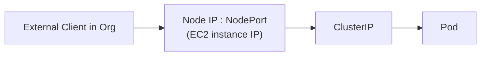

```bash
# Access
http://NodeIP:NodePort

# Get into a pod
kubectl exec -it pod-name -- /bin/sh
```

---

### iii) Load Balancer *(Production)*

> Expose app to the **internet via public IP** — load balancing done between nodes

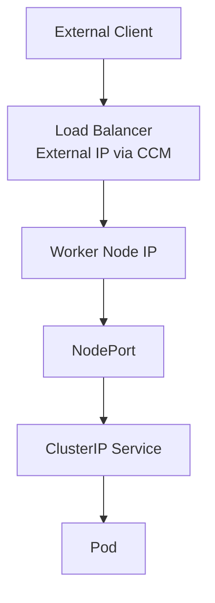

- **CCM** creates an external load balancer IP using the cloud provider
- Users access services using the **external IP**

---

## NodePort — How it Works

> When a service is created with **type: NodePort**, the `kube-proxy` updates **IPTables** with the Node IP address and port — choosing the service configuration to access the pods.

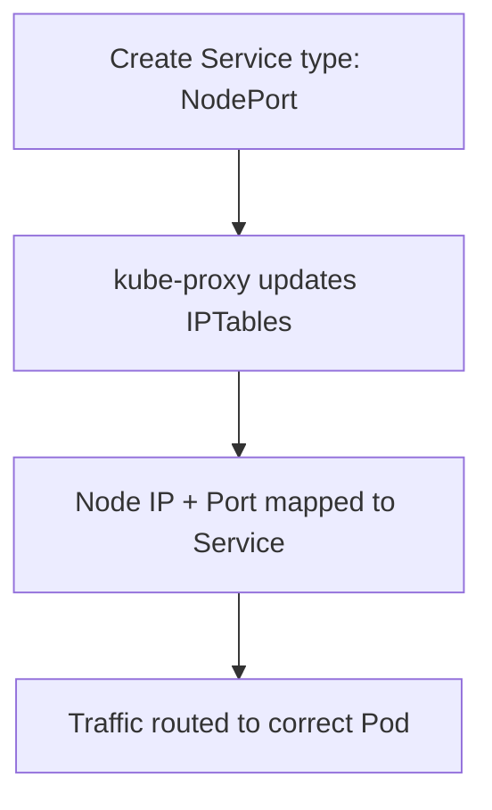

---

## Load Balancer — How it Works

> When a service is created with **type: LoadBalancer**, the **CCM** creates an external load balancer IP using the cloud provider.

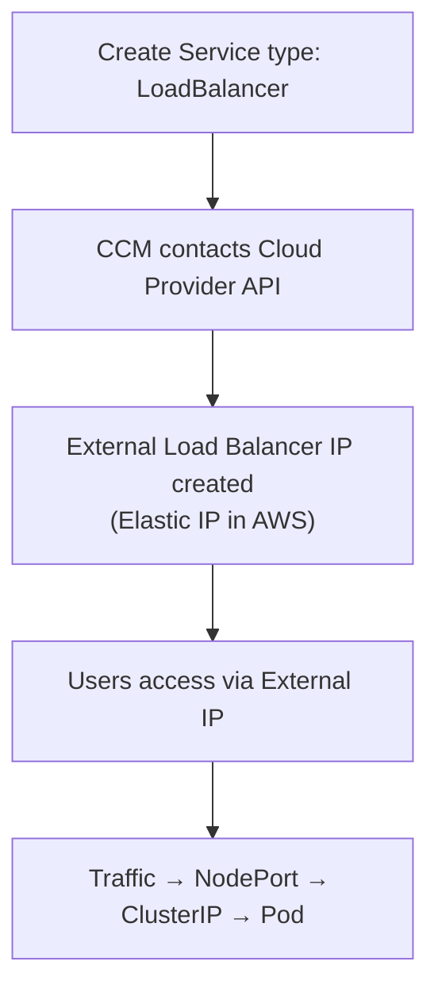

---

