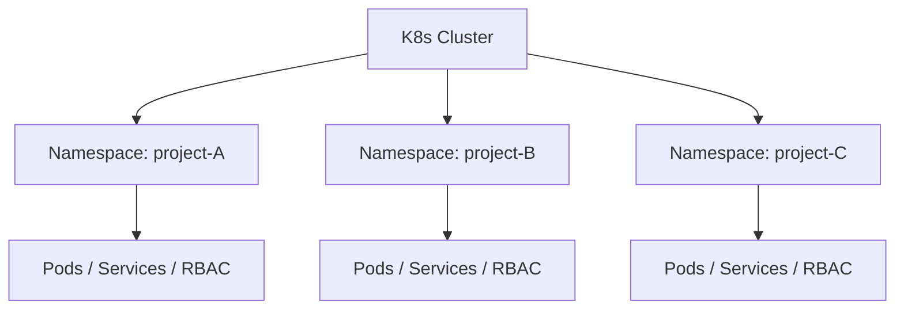
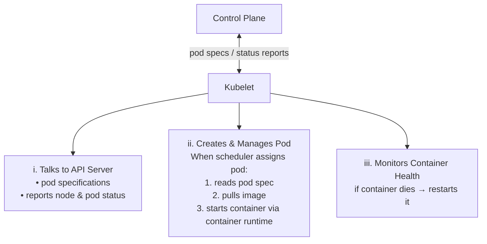
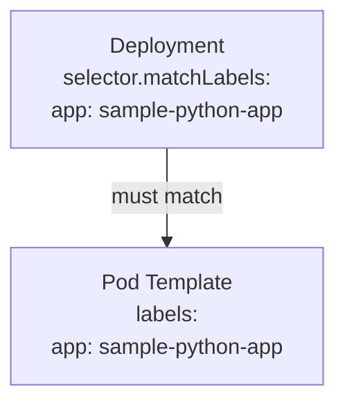
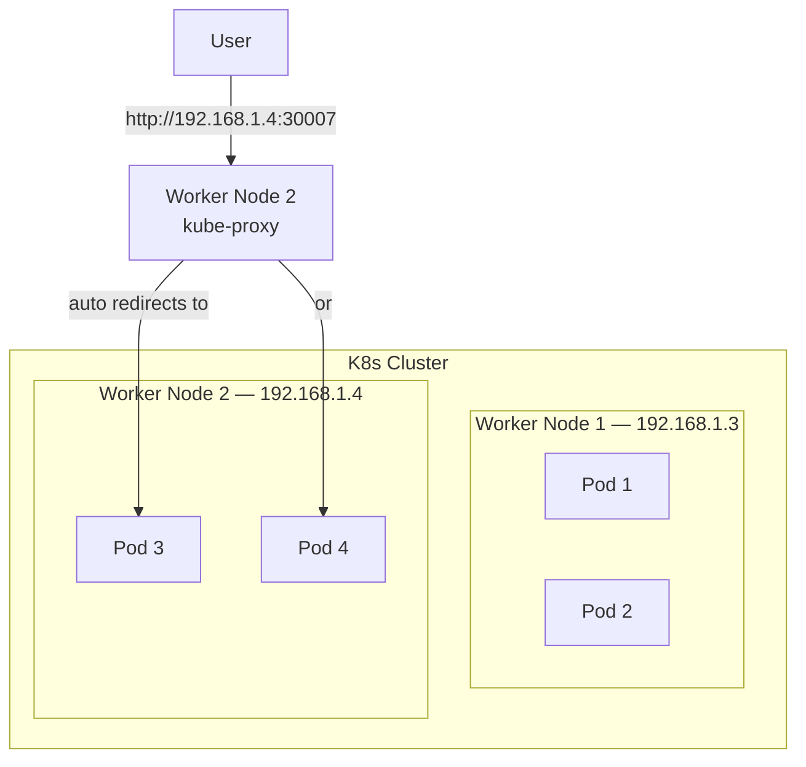
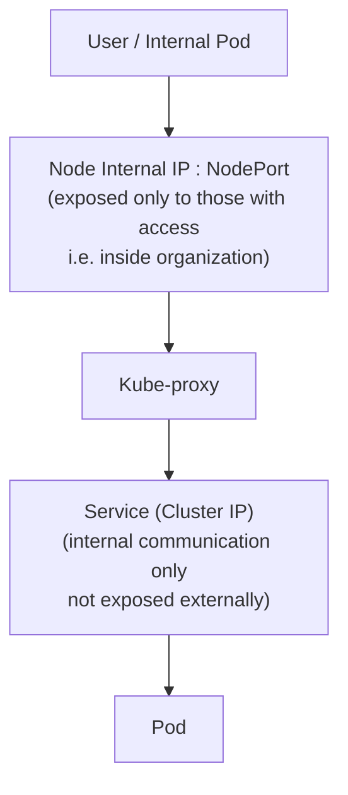

## 📌 Table of Contents

- Kubernetes Interview Questions
- Deployment YAML — Example
- Service YAML — Example
- NodePort — Practical Flow
- Internal IP and ClusterIP
- Editing Resources
---

## Kubernetes Interview Questions

### Q1. Difference between Docker & Kubernetes

| Characteristic | Docker | Kubernetes |
|---------------|--------|-----------|
| **What it is** | A containerization platform and runtime for building and running containers. | A container orchestration platform for automating the deployment, scaling, and management of containers at scale. |
| **Scope** | Operates on a single host machine. | Manages containers across a cluster of machines (multi-node environment). |
| **Primary Use** | Local development, rapid prototyping, and creating consistent application environments. | Running complex, production-grade, distributed systems with high availability. |
| **Scalability** | Manual scaling or relies on simple tools like Docker Swarm for basic orchestration. | Provides robust, automatic scaling (horizontal and vertical) based on demand and resource utilization. |
| **Self-Healing** | No built-in self-healing; requires manual intervention or scripting if a container fails. | Automatically restarts or replaces failed containers and reschedules them to healthy nodes. |
| **Load Balancing** | External tools are generally needed, or basic balancing with Docker Swarm. | Has built-in, advanced service discovery and load balancing capabilities. |

---

### Q2. Main Components of Kubernetes Architecture

> Control Plane → `kube-apiserver`, `scheduler`, `controller manager`, `CCM`, `etcd`
> Data Plane → `kubelet`, `kube-proxy`, `container runtime`

---

### Q3. Main Difference between Docker, Docker Swarm & Kubernetes

| Tool | Best For | Key Characteristics |
|------|----------|---------------------|
| **Kubernetes** | Large organizations | More scalability, networking capabilities like policies, huge third-party ecosystem support |
| **Docker Swarm** | Small applications | Very simple, limited features |

---

### Q4. Docker Container vs Kubernetes Pod

| Feature | Docker Container | Kubernetes Pod |
|---------|-----------------|----------------|
| **Definition** | Running instance of an image | Smallest deployable unit in K8s containing one or more containers |
| **Environment** | Single host | Cluster environment |
| **Network** | Has its own network | Containers share pod network |
| **Scaling & Healing** | ❌ Not supported | ✅ Supported via Deployments / HPA & Controllers |
| **Management** | CLI / Docker Compose | YAML files |

---

### Q5. Namespaces in Kubernetes

> **Logical isolation** of resources, network policies, RBAC & everything.

- Multiple projects run on the **same cluster** with their separate resources
- **No overlap** and no authentication problems between projects



---

### Q6. Role of Kube-Proxy

> **[Which pod belongs to which service]**

- Maintains a set of **network rules** on each node in the cluster, which are updated **dynamically**
- `http://NodeIP:NodePort` → Kube-proxy handles the request to that node
- Manages **iptables** & helps Kubernetes Service to maintain the IPs of pods when they change

---

### Q7. Different Types of Services in Kubernetes

| Type | Mode | Purpose |
|------|------|---------|
| **ClusterIP** | Internal only | Load balancing within cluster |
| **NodePort** | Within organization | Service discovery via node IP |
| **LoadBalancer** | Internet | Expose to internet via public IP |

---

### Q8. Difference Between NodePort & LoadBalancer Service

| | NodePort | LoadBalancer |
|-|---------|-------------|
| **Scope** | Inside organization (worker nodes) | External internet |
| **IP Type** | Node internal IP + NodePort | External / Elastic IP via CCM |
| **Load Balancing** | No load balancing across nodes | ✅ Load balancing between nodes |
| **Use Case** | Dev / staging | Production |

---

### Q9. Role of Kubelet

> **Communication Bridge** → `Control Plane ↔ Worker Node`

Ensures that the containers described in the pod are **running & healthy** on that node.



---

### Q10. Day-to-Day Activities on Kubernetes

| # | Activity |
|---|---------|
| i | Manage K8s cluster |
| ii | Debug applications with any problems |
| iii | Monitor K8s cluster |
| iv | Troubleshoot if any errors / problems occur |

**Production setup:**
```
3 Master Nodes  →  updates, avoid CVE
WN1  WN2  WN3  WN4  (Worker Nodes)
```

> **KubeShark** → Tool to visualize how traffic flows in a K8s cluster

---

## Deployment YAML — Full Example

> ⚠️ The `selector.matchLabels` in deployment **must match** the `labels` in `template.metadata`

```yaml
apiVersion: apps/v1
kind: Deployment
metadata:
  name: sample-python-app
  labels:
    app: sample-python-app
spec:
  replicas: 2
  selector:
    matchLabels:
      app: sample-python-app       # ← must match pod label below
  template:
    metadata:
      labels:
        app: sample-python-app     # ← must match selector above
    spec:
      containers:
      - name: python
        image: python
        ports:
        - containerPort: 8000
```



---

## Service YAML — Full Example

> ⚠️ The `selector` in Service **must match** the `labels` in Deployment

```yaml
apiVersion: v1
kind: Service
metadata:
  name: python-app-service        # service name
spec:
  type: NodePort
  selector:
    app: sample-python-app        # must be same as in deployment file
  ports:
    - port: 80                    # service port (inside cluster)
      targetPort: 8000            # container port (inside pod)
      nodePort: 30007             # external port on worker node
```

---

## NodePort — Practical Flow



**When you access `http://192.168.1.4:30007`:**
→ Kube-proxy will redirect the traffic to **any one pod automatically** (Pod 3 or Pod 4)

### Useful Commands

```bash
kubectl get nodes               # Get node IPs
kubectl get nodes -o wide       # Get Internal IPs (EC2 private IP / local machine IP / VM IP)
kubectl get svc                 # Get service details & Cluster IP
```

**Access via:**
```
http://Node Internal IP : NodePort
```

---

## Internal IP

> Actual Ip Address of the worker node
```bash
kubectl get nodes -o wide     # Shows IP of Worker Node
```

---

## ClusterIP

> Used **only inside the K8s cluster**:
> - i) Pod inside cluster
> - ii) Another service
> - iii) Internal virtual IP of K8s service




```bash
kubectl get svc     # Shows internal virtual IP of K8s service
```

---

## Editing Live Resources

### `kubectl edit` — Live Edit

```bash
kubectl edit svc/<service-name>
kubectl edit deployment/<deployment-name>
```

> Opens the **live resource** in editor — updates are applied **automatically when saved** ✅

---

### `vim filename` — File Edit

```bash
vim filename.yaml
# manually edit labels, replicas, etc.
```

> After manual edits to file, you **must rerun**:
```bash
kubectl apply -f filename.yaml
# OR
kubectl create -f filename.yaml
```

| Method | Auto Update? | Command Needed After Edit? |
|--------|-------------|---------------------------|
| `kubectl edit` | ✅ Yes — live update | ❌ No |
| `vim filename` | ❌ No | ✅ `kubectl apply` or `kubectl create` |

---

