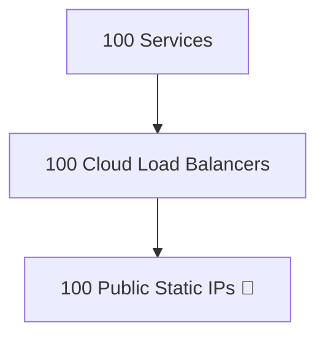
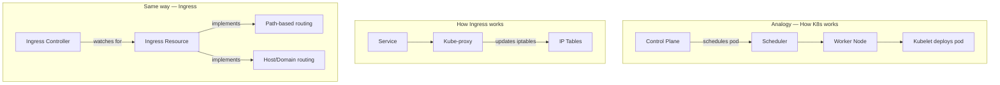
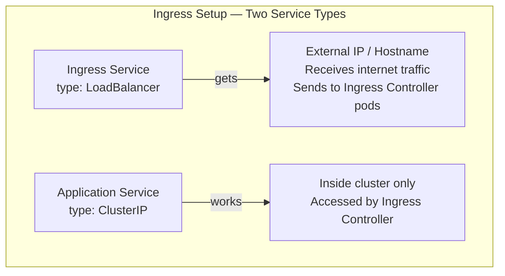
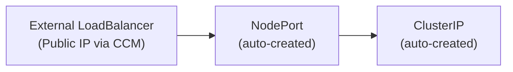
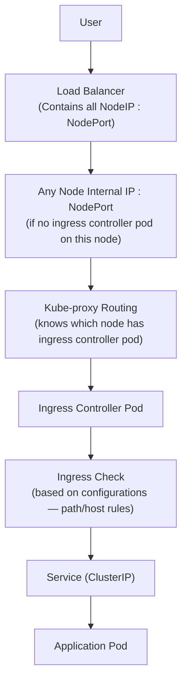

---

## 📌 Table of Contents

- Ingress — Overview
- Problems with Kubernetes Services
- Ingress Prerequisites
- Ingress Controller vs Ingress Resource
- Steps to Setup Ingress
- Service Types in Ingress Setup
- LoadBalancer Auto-Creation Chain
- Ingress Full Traffic Flow
---

## Ingress — Overview

> **Ingress provides advanced routing for HTTP/HTTPS traffic and works on top of Kubernetes Services..**

> ✅ Ingress provides **routing to services** using host or path rules.
> The actual **load balancing between pods** is still handled by K8s Service using **Endpoints**.

---

## Problems with Kubernetes Services

### 1. Not Enterprise-Level Support

Services do **not** provide:

| # | Missing Feature |
|---|----------------|
| i | TLS (HTTPS encryption) |
| ii | Path-based routing |
| iii | Domain / Host-based routing |
| iv | IP whitelisting / blacklisting |
| v | Rate limiting |
| vi | Ratio-based traffic management |

> **Services operate at Layer 4(TCP/UDP), so they cannot provide HTTP-specific features like path routing or TLS termination. Ingress works as Layer 7(HTTP/HTTPS)**
---

### 2. Basic & Simple Load Balancing

- Uses a simple **round-robin algorithm** through Kube-proxy
- **No advanced traffic control** mechanisms

---

### 3. High Cost Due to Multiple Public IPs

> For `type: LoadBalancer` — each service creates a **separate** external load balancer with its own public IP.



**Example:**
```
user-service    ⇒  LB + public IP
payment-service ⇒  LB + public IP
```

This causes:
- i) **High cost**
- ii) Too many exposed endpoints
- iii) Hard to manage

> ✅ **Solution:** Use enterprise-grade software/hardware load balancers like **nginx, F5, HAProxy** — these have enterprise support.

---

## Ingress Prerequisites

Two components are needed:

| Component | Who Manages It | Examples |
|-----------|---------------|---------|
| **Ingress Controller** | DevOps / Infra team | nginx, F5 |
| **Ingress Resource** | Developers (write YAML rules) | path rules, host rules |

---

## Ingress Controller vs Ingress Resource



> In the same way that **Kube-proxy** watches for Services and updates IP tables,
> the **Ingress Controller** watches for Ingress resources and implements routing rules.

---

## Steps to Setup Ingress

### Step i — Install Ingress Controller

```bash
# Install NGINX Ingress Controller
kubectl apply -f https://raw.githubusercontent.com/kubernetes/ingress-nginx/main/deploy/static/provider/cloud/deploy.yaml

# OR install F5 Ingress Controller
```

### Step ii — What Kubernetes Auto-Creates After Installation

| Resource | Name |
|----------|------|
| **Namespace** | `ingress-nginx` |
| **Deployment** | `ingress-nginx-controller` |
| **Pods** | Ingress controller pods |
| **Service** | To expose the controller |

```bash
kubectl get pods -n ingress-nginx     # View ingress controller pods
kubectl get svc -n ingress-nginx      # View ingress service
kubectl get ingress                   # View ingress resources
```

> ✅ Ingress Controller runs on one of the **worker nodes**, just like application pods.
> ✅ Ingress Controller usually runs as multiple pods across nodes for high availability.

---

## Service Types in Ingress Setup



| Service | Type | Role |
|---------|------|------|
| **Ingress-nginx service** | `LoadBalancer` | Gets external IP, receives internet traffic, forwards to ingress controller pods |
| **Your application service** | `ClusterIP` | Works inside cluster, accessed by ingress controller |

---

## LoadBalancer Auto-Creation Chain

> When `type: LoadBalancer` is created, it **automatically creates** the others:



### Ingress Service Example Output

```bash
kubectl get svc -n ingress-nginx
```

| Name | Type | Cluster IP | External IP | Port(s) |
|------|------|-----------|-------------|---------|
| ingress-nginx-controller | LoadBalancer | 10.46.10.23 | 35.200.1.10 | 80:31567/TCP |

> Service port `80` → NodePort `31567` automatically created
> After getting a request to the External IP, it sends the request to the worker node where the ingress pod is running.

---

## Ingress Full Traffic Flow



---


