# 📘 Kubernetes


---

## 📌 Table of Contents
- RBAC — Role Based Access Control
- RBAC — Role Based Access Control (Deep Dive)
- Users vs Service Accounts
- RBAC Components
- Service Account — Full YAML Flow
- Cluster Role vs Role
- Kubernetes API Server — Access Flow
- Custom Resources (CRD)
- Tools That Use CRDs
- Ingress vs Istio Virtual Service
- ConfigMap
- Secrets
- ConfigMap via VolumeMount (Live Update)

---


## RBAC — Role Based Access Control

> Controls **who can do what** inside the Kubernetes cluster.

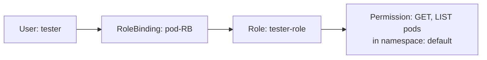

### Role YAML

```yaml
apiVersion: rbac.authorization.k8s.io/v1
kind: Role
metadata:
  name: tester-role
  namespace: default
rules:
- apiGroups: [""]
  resources: ["pods"]
  verbs: ["get", "list"]
```

### RoleBinding YAML

```yaml
apiVersion: rbac.authorization.k8s.io/v1
kind: RoleBinding
metadata:
  name: pod-RB
  namespace: default
subjects:
- kind: User
  name: tester
  apiGroup: rbac.authorization.k8s.io
roleRef:
  kind: Role
  name: tester-role
  apiGroup: rbac.authorization.k8s.io
```

### Role vs RoleBinding

| | Role | RoleBinding |
|-|------|-------------|
| **Purpose** | Defines **what** permissions exist | Assigns the role **to a user/group** |
| **Contains** | `resources` + `verbs` (get, list, create, delete) | `subjects` (user/group) + `roleRef` (which role) |
| **Scope** | Namespace-level | Namespace-level |

---


## RBAC — Role Based Access Control (Deep Dive)

> Controls **who** can do **what** on **which resources** inside the Kubernetes cluster.

---

## Users vs Service Accounts

| | Users | Service Accounts |
|-|-------|-----------------|
| **Who** | Human users who access the K8s cluster | Applications (Pods) inside Kubernetes that talk with API Server |
| **Examples** | Developer — view pods, create deployments | Pod might need to — read secrets, create jobs, read ConfigMaps |
| **Access type** | Developer access | Pod access |

### Example Scenarios

| User Example | Service Account Example |
|-------------|------------------------|
| **User:** Santhosh | **Pod:** monitoring-pod |
| **Role:** developer-role | **ServiceAccount:** monitor-sa |
| **Permissions:** create pods, get pods, list services | **Permissions:** get pods, watch nodes |

---

## RBAC Components

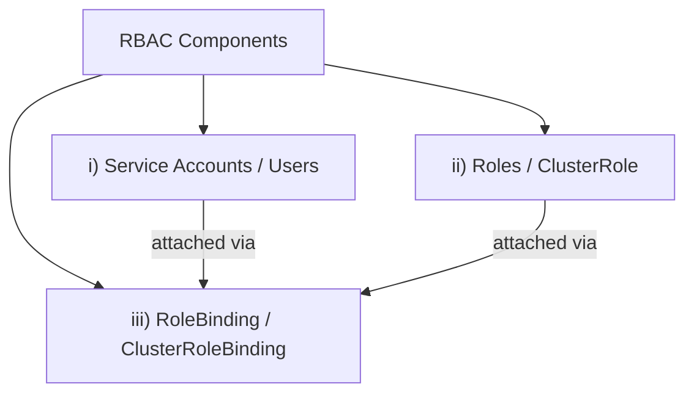

| Kind | What it is |
|------|-----------|
| **Role** | YAML file — defines a **set of permissions** |
| **RoleBinding** | YAML file — **attaches** a role to a user/service account |
| **ClusterRole** | Defines **cluster-wide** permissions (Nodes, Persistent Volumes) |
| **ClusterRoleBinding** | Assigns ClusterRole cluster-wide |

> **Scenario i** → Which user can use which resource with which access (list, get) → **User**
> 
> **Scenario ii** → Pod needs permission to view status of other pods → **Service Account**

---

## Service Account — Full YAML Flow

### Scenario II — Pod watching other Pods

> By default, a pod **can't access another pod** because the service account is set to `default`.
> To give a pod permission to view the status of other pods → use **Service Accounts**.

### Step 1 — Create Role

```yaml
apiVersion: rbac.authorization.k8s.io/v1
kind: Role
metadata:
  name: pod-watch-role
  namespace: default
rules:
- apiGroups: [""]
  resources: ["pods"]       # also: configmaps, secrets
  verbs: ["get", "list", "watch"]
```

### Step 2 — Create Service Account

```yaml
apiVersion: v1
kind: ServiceAccount
metadata:
  name: pod-watch-sa
  namespace: default
```

> **IAM users** → mapped to K8s user → RBAC RoleBinding

### Step 3 — Create RoleBinding (bind Service Account to Role)

```yaml
apiVersion: rbac.authorization.k8s.io/v1
kind: RoleBinding
metadata:
  name: pod-watch-role-binding
  namespace: default
subjects:
- kind: ServiceAccount
  name: pod-watch-sa
  namespace: default
roleRef:
  kind: Role
  name: pod-watch-role
  apiGroup: rbac.authorization.k8s.io
```

### Step 4 — Attach Service Account to Pod (in deployment file)

```yaml
spec:
  serviceAccountName: pod-watch-sa
```

### Full RBAC Flow

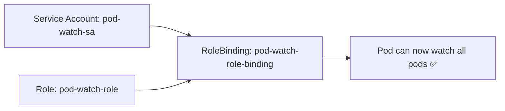

---

## Cluster Role vs Role

| | Role | ClusterRole |
|-|------|------------|
| **Scope** | Namespace-level | Cluster-wide |
| **Resources** | Pods, Services, Secrets (in a namespace) | Nodes, Persistent Volumes (cluster-level) |
| **Binding** | RoleBinding | ClusterRoleBinding |

---

## Kubernetes API Server — Access Flow

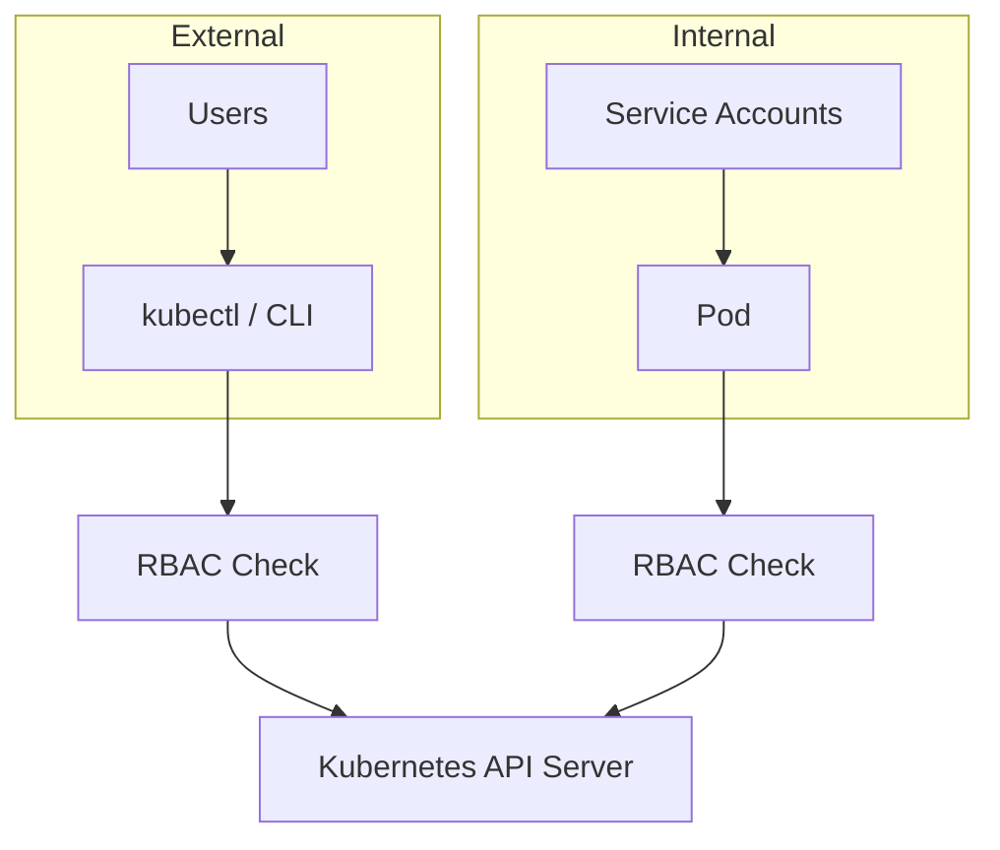

---

## Custom Resources (CRD)

> A **user-defined resource** that extends the Kubernetes API to manage custom applications or workloads.

### Three Components

| Component | Description |
|-----------|-------------|
| **i) Custom Resource (CR)** | The actual object you create using CRD |
| **ii) Custom Resource Definition (CRD)** | `.yaml` file — defines a new resource (type of API) to Kubernetes |
| **iii) Custom Controller** | Watches CR and reconciles actual vs desired state |

> K8s has its own built-in resource definitions for Deployment, Service, Secrets — same concept for CRDs.

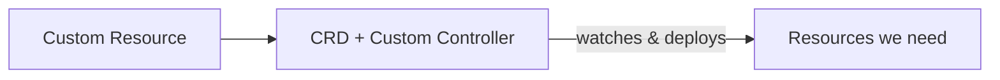

---

## Tools That Use CRDs

| Tool | Custom Resource |
|------|----------------|
| **ArgoCD** | Application |
| **Istio** | VirtualService, Gateway |
| **Prometheus Operator** | Prometheus, ServiceMonitor |

### If Using Existing Tools (ArgoCD, Istio…)

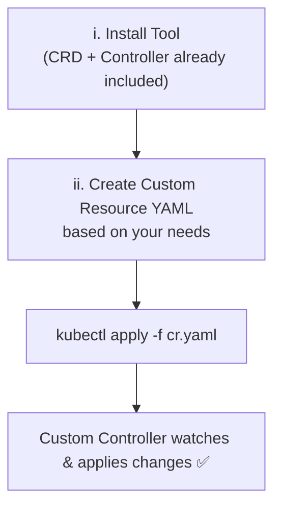

### If Building Your Own System

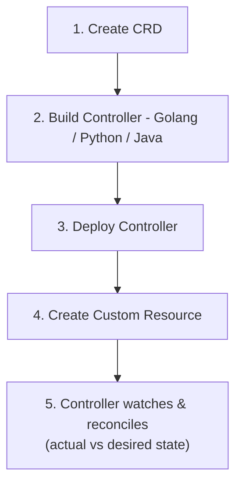

---

## Ingress vs Istio Virtual Service

### When is Ingress Enough?

| Use Case | Tool |
|----------|------|
| Expose services externally | ✅ Ingress |
| Host-based routing | ✅ Ingress |
| Path-based routing | ✅ Ingress |

### When to Use Istio Virtual Service?

| Advanced Feature | Istio Virtual Service |
|-----------------|----------------------|
| Canary deployment (traffic shift old → new slowly) | ✅ |
| A/B testing (mobile → v2, desktop → v1) | ✅ |
| Path-based routing | ✅ |
| Header-based routing | ✅ |
| Fault injection | ✅ |
| Retry & Timeout | ✅ |

> **'Advanced traffic routing & service mesh features'**

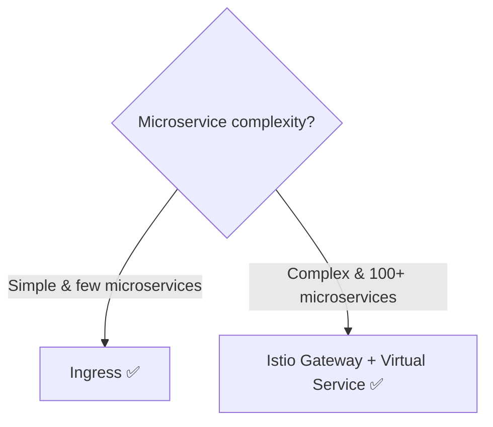

---

## ConfigMap

> Stores **non-sensitive** application configuration data.

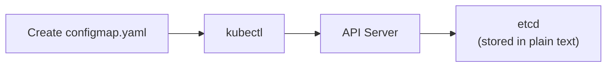

### ⚠️ Disadvantages of ConfigMap

| Risk | How |
|------|-----|
| `kubectl describe configmap` exposes all data | Anyone with kubectl access can read it |
| Access to etcd exposes all data | etcd stores ConfigMap in plain text |

### Using ConfigMap in Deployment (as Env Variable)

```yaml
spec:
  containers:
  - name: app
    image: <image-name>
    env:
    - name: DB_PORT                   # env var name for application in pod
      valueFrom:
        configMapKeyRef:
          name: test-cm               # ConfigMap name
          key: <key-in-configmap>     # key from ConfigMap
```

---

## Secrets

> Stores **sensitive** data (passwords, tokens, keys).

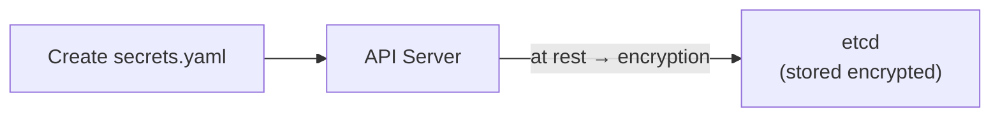

### ✅ Advantages of Secrets over ConfigMap

| Advantage | How |
|-----------|-----|
| **Encrypted at rest** in etcd | Decryption key required — impossible for hackers |
| **RBAC — Principle of Least Privilege** | Only give access to required persons via RBAC |

---

## ConfigMap via VolumeMount (Live Update)

> Use **VolumeMounts** to get **instant updates** without pod restart or redeployment.

### Using ConfigMap as Volume (Live Update)

```yaml
spec:
  containers:
  - name: app
    image: <image-name>
    volumeMounts:
    - name: db-connection
      mountPath: /opt               # mounted path inside container
    ports:
    - containerPort: 8000
  volumes:
  - name: db-connection
    configMap:
      name: test-cm                 # ConfigMap name
```

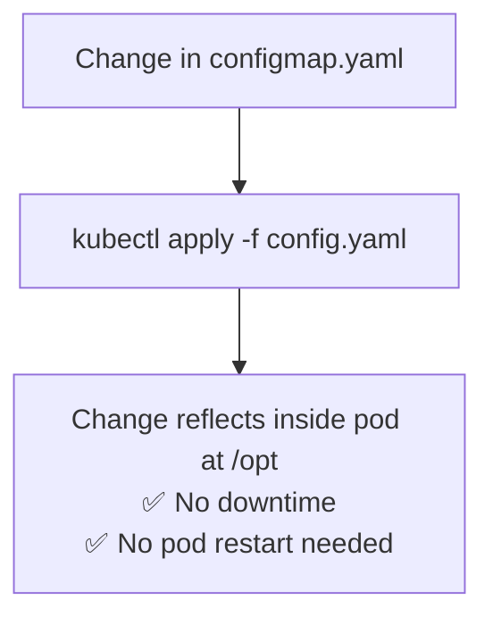

### Env Variable vs VolumeMount

| Method | Live Update? | What to do on Change |
|--------|-------------|---------------------|
| **env + configMapKeyRef** | ❌ No | Restart pods / redeploy deployment |
| **volumeMounts + configMap** | ✅ Yes | Just `kubectl apply -f config.yaml` |

> 💡 Same process applies for **Secret** file management as well.

---
