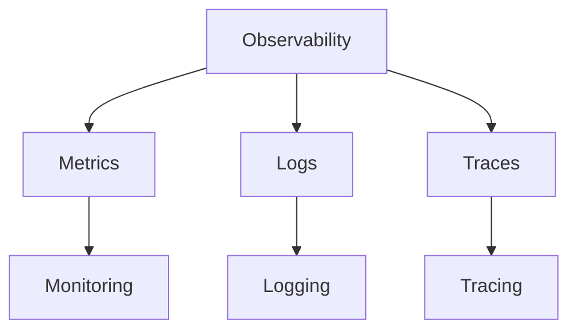
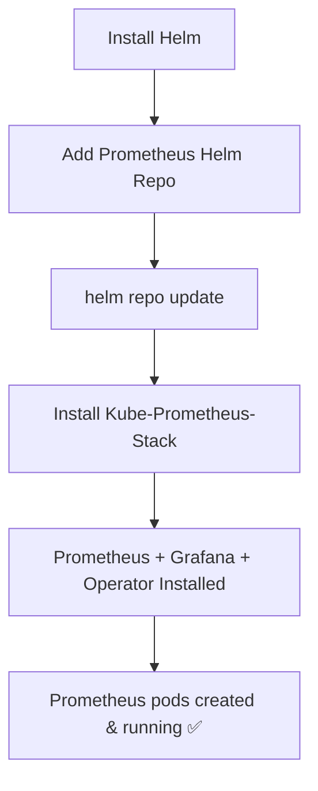
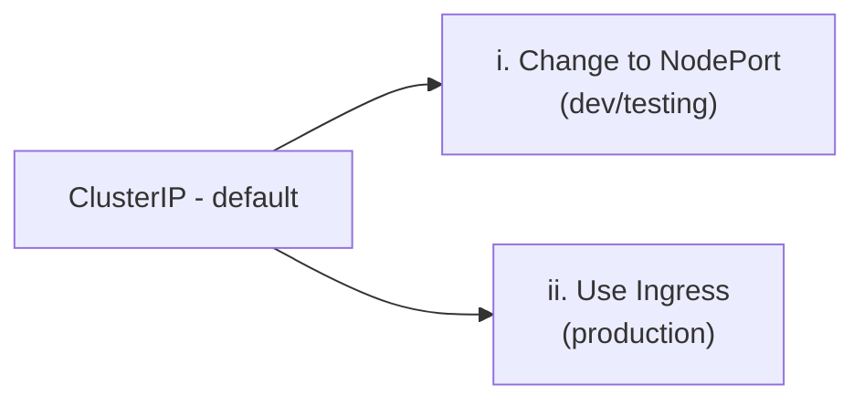
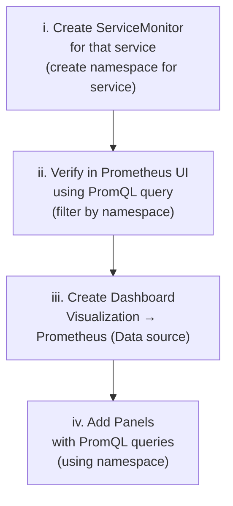
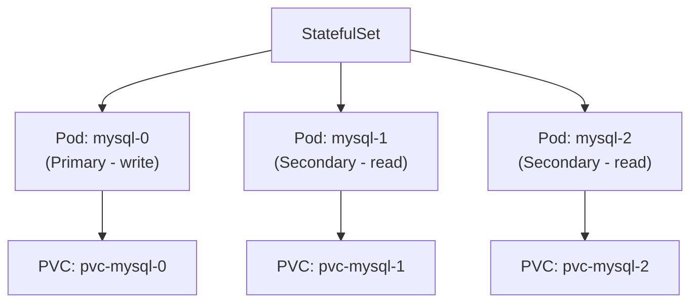
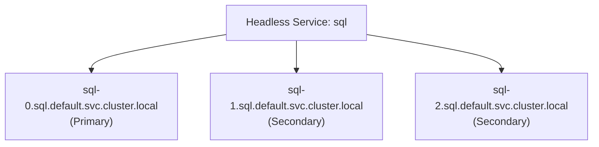
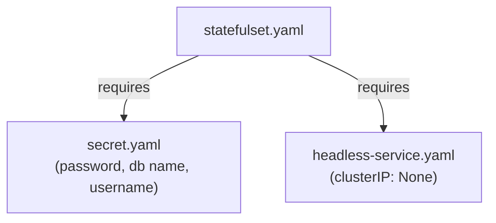

## 📌 Table of Contents

- [Kubernetes Monitoring & Observability](#kubernetes-monitoring--observability)
- [Observability vs Monitoring vs Logging vs Tracing](#observability-vs-monitoring-vs-logging-vs-tracing)
- [Why Observability & Monitoring?](#why-observability--monitoring)
- [Prometheus](#prometheus)
- [Prometheus Installation via Helm](#prometheus-installation-via-helm)
- [What Gets Installed with Prometheus (Helm)](#what-gets-installed-with-prometheus-helm)
- [Kube-State-Metrics](#kube-state-metrics)
- [Accessing Grafana Dashboard](#accessing-grafana-dashboard)
- [Creating a Dashboard for a Specific Service](#creating-a-dashboard-for-a-specific-service)
- [StatefulSet — For Databases](#statefulset--for-databases)
- [Headless Service](#headless-service)
- [StatefulSet DNS & Pod Naming](#statefulset-dns--pod-naming)
- [VolumeClaimTemplates](#volumeclaimtemplates)
- [StatefulSet Required Files](#statefulset-required-files)

---

## Kubernetes Monitoring & Observability

### Definitions

| Term | Definition |
|------|-----------|
| **Observability** | Ability to understand the **internal state** of a system by analyzing the data it produces — logs, metrics & traces |
| **Monitoring** | Tracking system metrics like CPU usage, memory usage, network performance |
| **Logging** | Collection of logs from various components of a system |
| **Tracing** | Tracking the flow of a request or transaction as it moves through different services & components |

---

## Observability vs Monitoring vs Logging vs Tracing



---

## Why Observability & Monitoring?

### Why Observability?

| # | Reason |
|---|--------|
| i | Diagnose issues |
| ii | Understand behaviour |
| iii | Improve systems |

> **Example:** If a website is slow, it helps us trace the user's request through different services to find the **bottleneck**. 

### Why Monitoring?

| # | Reason |
|---|--------|
| i | Detect problems early |
| ii | Measure performance |
| iii | Ensure availability |

> **Example:** If a server CPU usage goes above 90%, it will **alert** us.

---

## Prometheus

> **Open source monitoring & alerting toolkit**

Known for:
- i) **Robust data model**
- ii) **Powerful query language (PromQL)**
- iii) **Generate alerts** based on collected time-series data

---

## Prometheus Installation via Helm



```bash
# Install Helm
# Add prometheus repo
helm repo add prometheus-community https://prometheus-community.github.io/helm-charts
helm repo update

# Install Kube-Prometheus-Stack
helm install monitoring prometheus-community/kube-prometheus-stack -n monitoring
```

---

## What Gets Installed with Prometheus (Helm)

| Component | Role |
|-----------|------|
| **Prometheus Server** | Collects & stores metrics |
| **Grafana** | Visual dashboard |
| **Alert Manager** | Sends alerts |
| **Kube-State-Metrics** | Exposes Kubernetes object metrics |
| **Node-Exporter** | Node-level metrics (CPU, memory) |
| **Prometheus Operator** | Manages Prometheus configurations |

---

## Kube-State-Metrics

> Provides information about the existing K8s cluster **beyond** what the API server provides.

Examples:
- i) Pods created
- ii) Services created

```bash
# Expose Prometheus with NodePort
# Get the IP → [minikube ip]
http://ip:nodeport     # to access Prometheus UI
```

---

## Accessing Grafana Dashboard

> By default, Prometheus & Grafana are created as **ClusterIP** services.

### To access from browser:



```bash
# Access Grafana
http://IP:NodePort

# Login
# Username: admin
# Password: stored in Kubernetes Secret

kubectl get secret -n monitoring
kubectl get secret monitoring-grafana -n monitoring \
  -o jsonpath="{.data.admin-password}" | base64 --decode
```

> ✅ Prometheus is **already connected as datasource** — no extra configuration needed.

---

## Creating a Dashboard for a Specific Service



---

## StatefulSet — For Databases

> **For DB:** `StatefulSet` + `Headless Service` + `secret.yaml`

`Kind: StatefulSet` is used for:

| # | Feature |
|---|---------|
| i | **Persistent storage** — data survives pod restarts |
| ii | **Stable pod names** — `sql-0`, `sql-1`, `sql-2` |
| iii | **Stable network identity** — same DNS name even after restart |



---

## Headless Service

> StatefulSet **needs** a Headless Service — gives each pod its own **DNS name**.

```yaml
apiVersion: v1
kind: Service
metadata:
  name: mongo
spec:
  clusterIP: None          # ← This makes it Headless
  selector:
    app: mongo
  ports:
    - port: 27017
```

> `clusterIP: None` → makes it a **Headless Service** (no virtual IP, direct pod DNS)

---

## StatefulSet DNS & Pod Naming



**DNS format per pod:**
```
<pod-name>.<service-name>.<namespace>.svc.cluster.local
sql-0.sql.default.svc.cluster.local
```

- Pod names are created by the **DB driver** (e.g., sql manager) on their own
- If a pod restarts → **new pod gets the same name & same DNS name** ✅

### Backend Connection to DB

```bash
# Backend connects to service name
sql://sql:3600

# K8s resolves it to:
sql.default.svc.cluster.local   # → then groups pods

# DB driver discovers:
# write → primary (sql-0)
# read  → secondary (sql-1, sql-2)
```

---

## VolumeClaimTemplates

> Creates **separate PVC per pod** automatically in a StatefulSet.

### In deployment template spec (volumeMounts):

```yaml
volumeMounts:
  - name: mysql-data
    mountPath: /var/lib/mysql
```

### In StatefulSet spec (volumeClaimTemplates):

```yaml
volumeClaimTemplates:
  - metadata:
      name: mysql-data
    spec:
      accessModes: ["ReadWriteOnce"]
      resources:
        requests:
          storage: 100Mi
```

### Result — Each Pod gets its own PVC

| Pod | Volume (PVC) | Mount Path |
|-----|-------------|-----------|
| `mysql-0` | `pvc-mysql-0` | `/var/lib/mysql` |
| `mysql-1` | `pvc-mysql-1` | `/var/lib/mysql` |
| `mysql-2` | `pvc-mysql-2` | `/var/lib/mysql` |

> In **AWS EBS**, 3 volumes will be created (one per pod).

---

## StatefulSet Required Files



### What StatefulSet Guarantees (even after pod restart)

| Guarantee | Detail |
|-----------|--------|
| ✅ Same Volume | PVC is retained — data not lost |
| ✅ Same DNS | `pod-name.service-name.namespace.svc.cluster.local` |
| ✅ Same Pod Name | `mysql-0`, `mysql-1`, `mysql-2` — always the same |

> **StatefulSet + Headless Service** → the combination used for all **database pods** in Kubernetes.

---

